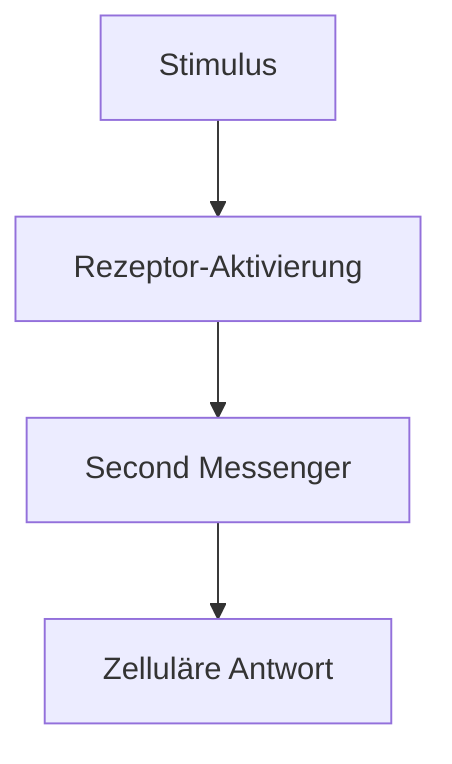

# Scientific Analysis & Visualization Skill

## Beschreibung
Dieser Skill erstellt hochwertige wissenschaftliche Diagramme, Grafiken, Tabellen und interaktive Visualisierungen aus medizinischen und neurowissenschaftlichen Daten. Er analysiert wissenschaftliche PDFs, extrahiert Daten und bereitet sie visuell professionell auf — auf dem Niveau eines erfahrenen Grafikdesigners und Wissenschaftskommunikators.

## Wann dieser Skill aktiviert wird
Dieser Skill wird **automatisch** aktiviert bei:
- Erstellung von PowerPoint-Präsentationen
- Analyse wissenschaftlicher PDFs oder Paper
- Anfragen zu medizinischen/neurowissenschaftlichen Visualisierungen
- Erstellung von Diagrammen, Grafiken, Tabellen oder Charts
- Pathophysiologie-Darstellungen
- Neurotransmitter-System-Visualisierungen
- Studienanalysen und Methodenübersichten
- Jeder Anfrage die wissenschaftliche Daten visuell aufbereiten soll

## Kernfähigkeiten

### 1. PDF-Analyse & Datenextraktion
- Lese wissenschaftliche PDFs vollständig (alle Seiten systematisch durchgehen)
- Extrahiere: Studiendesign, Methodik, Ergebnisse, Statistiken, Tabellen, Abbildungsbeschreibungen
- Identifiziere Schlüsseldaten für Visualisierung (Effektgrößen, p-Werte, Konfidenzintervalle, Dosierungen, Outcomes)
- Fasse Kernaussagen strukturiert zusammen
- Erkenne Journal-spezifische Formatierung und lehne Visualisierungen daran an

### 2. Wissenschaftliche Diagramme & Grafiken

#### Pathophysiologie-Diagramme
- Neuronale Schaltkreise und Signalwege
- Neurotransmitter-Systeme (Dopamin, Serotonin, Noradrenalin, GABA, Glutamat, Acetylcholin)
- Rezeptor-Interaktionen und Bindungsprofile
- Pharmakodynamische Wirkmechanismen
- Blut-Hirn-Schranke und Transportmechanismen
- Neuroinflammatorische Kaskaden

#### Statistische Grafiken
- Forest Plots (Meta-Analysen)
- Kaplan-Meier-Kurven
- Funnel Plots
- ROC-Kurven
- Box-/Violin-Plots
- Heatmaps für Korrelationsmatrizen
- Netzwerk-Meta-Analysen

#### Studienübersichten
- PRISMA-Flussdiagramme
- CONSORT-Diagramme
- Studiendesign-Übersichten
- Zeitachsen klinischer Studien
- Vergleichstabellen verschiedener Studien

### 3. Visualisierungs-Technologien

#### Primär: Python mit Matplotlib/Plotly/Seaborn
Erstelle Python-Skripte die hochwertige Grafiken generieren:

```python
# Standard-Imports für wissenschaftliche Visualisierung
import matplotlib.pyplot as plt
import matplotlib.patches as mpatches
from matplotlib.patches import FancyBboxPatch, FancyArrowPatch
import matplotlib.patheffects as pe
import seaborn as sns
import plotly.graph_objects as go
import plotly.express as px
from plotly.subplots import make_subplots
import numpy as np
import pandas as pd
```

#### Sekundär: Mermaid-Diagramme
Für schnelle Flussdiagramme und Prozessdarstellungen:


#### Tertiär: SVG für Inline-Grafiken
Für skalierbare, druckfähige Vektorgrafiken.

#### PowerPoint-Export: python-pptx
Für direkte PPTX-Erstellung mit eingebetteten Grafiken:
```python
from pptx import Presentation
from pptx.util import Inches, Pt, Emu
from pptx.dml.color import RGBColor
from pptx.enum.text import PP_ALIGN
```

### 4. Design-Standards

#### Farbpaletten (wissenschaftlich)
```
NEVPAZ Primär:       #1a5276 (Dunkelblau), #2980b9 (Mittelblau)
Neurotransmitter:
  - Dopamin:         #E74C3C (Rot)
  - Serotonin:       #3498DB (Blau)
  - Noradrenalin:    #E67E22 (Orange)
  - GABA:            #2ECC71 (Grün)
  - Glutamat:        #9B59B6 (Lila)
  - Acetylcholin:    #1ABC9C (Türkis)

Akzentfarben:        #F39C12 (Gold), #ECF0F1 (Hellgrau)
Hintergrund:         #FFFFFF (Weiß), #F8F9FA (Off-White)
Signifikanz:         #27AE60 (p<0.05), #E74C3C (n.s.)
```

#### Typografie
- Titel: Calibri Bold, 24-28pt
- Untertitel: Calibri, 18-20pt
- Achsenbeschriftung: Calibri, 12-14pt
- Anmerkungen: Calibri Light, 9-10pt
- Code/Daten: Consolas/Courier, 10pt

#### Layout-Prinzipien
- Seitenverhältnis: 16:9 für Präsentationen, variabel für Paper
- Weißraum: Mindestens 15% Rand
- Gridlines: Dezent, hellgrau (#E0E0E0), gestrichelt
- Legende: Rechts oben oder unterhalb des Diagramms
- Quellenangabe: Immer unten rechts, klein (8pt)
- DPI: Mindestens 300 für Druckqualität

### 5. Arbeitsablauf

#### Bei PDF-Analyse:
1. PDF vollständig lesen (alle Seiten, systematisch in 20er-Blöcken)
2. Metadaten extrahieren (Autoren, Journal, DOI, Jahr)
3. Studiendesign und Methodik identifizieren
4. Kernergebnisse und Statistiken extrahieren
5. Tabellen und Abbildungsbeschreibungen erfassen
6. Daten in strukturiertes Format überführen
7. Passende Visualisierungstypen auswählen
8. Grafiken in höchster Qualität erstellen
9. Optional: PowerPoint-Präsentation generieren

#### Bei Diagramm-Erstellung:
1. Thema und Zielgruppe klären
2. Datenquelle identifizieren (PDF, manuelle Eingabe, Datenbank)
3. Geeigneten Diagrammtyp wählen
4. Python-Skript erstellen mit professionellem Design
5. Grafik generieren und als PNG/SVG/PDF speichern
6. Bei Bedarf in PPTX einbetten

#### Bei PowerPoint-Erstellung:
1. Inhaltliche Struktur planen (Gliederung)
2. Daten aus PDFs/Quellen extrahieren
3. Für jede Folie passende Visualisierung wählen
4. python-pptx Skript erstellen
5. Grafiken inline generieren und einbetten
6. Einheitliches Design durchgehend anwenden
7. PPTX-Datei exportieren

### 6. Vorlagen-Bibliothek

#### Neurotransmitter-Pathway-Diagramm
```python
def create_neurotransmitter_pathway(
    transmitter: str,
    pathway_steps: list,
    receptors: list,
    effects: list,
    title: str = None,
    output_path: str = "pathway.png"
):
    """
    Erstellt ein professionelles Neurotransmitter-Pathway-Diagramm.

    Args:
        transmitter: Name des Neurotransmitters (z.B. "Dopamin")
        pathway_steps: Liste der Schritte im Signalweg
        receptors: Liste der beteiligten Rezeptoren
        effects: Liste der Endeffekte
        title: Optionaler Titel
        output_path: Speicherpfad für die Grafik
    """
    fig, ax = plt.subplots(1, 1, figsize=(16, 10), facecolor='white')
    # ... professionelle Implementierung mit Boxen, Pfeilen, Farben
    plt.savefig(output_path, dpi=300, bbox_inches='tight', facecolor='white')
    plt.close()
```

#### Forest Plot (Meta-Analyse)
```python
def create_forest_plot(
    studies: list,
    effects: list,
    ci_lower: list,
    ci_upper: list,
    weights: list = None,
    overall_effect: float = None,
    title: str = "Forest Plot",
    output_path: str = "forest_plot.png"
):
    """
    Erstellt einen publikationsreifen Forest Plot.
    """
    fig, ax = plt.subplots(figsize=(12, max(6, len(studies) * 0.6)))
    # ... professionelle Implementierung
    plt.savefig(output_path, dpi=300, bbox_inches='tight')
    plt.close()
```

#### Interaktive Plotly-Grafik
```python
def create_interactive_chart(
    data: pd.DataFrame,
    chart_type: str = "scatter",
    x_col: str = None,
    y_col: str = None,
    color_col: str = None,
    title: str = "",
    output_path: str = "interactive.html"
):
    """
    Erstellt eine interaktive Grafik mit Plotly.
    Exportiert als HTML (interaktiv) und PNG (statisch).
    """
    # ... professionelle Implementierung
    fig.write_html(output_path)
    fig.write_image(output_path.replace('.html', '.png'), scale=3)
```

### 7. Qualitätskriterien

Jede erstellte Visualisierung MUSS folgende Kriterien erfüllen:

- [ ] **Wissenschaftliche Korrektheit**: Daten und Beschriftungen sind korrekt
- [ ] **Quellenangabe**: Jede Grafik enthält die Quelle (Autor, Jahr, Journal)
- [ ] **Lesbarkeit**: Schriftgrößen sind angemessen, Kontraste ausreichend
- [ ] **Farbkodierung**: Konsistente, barrierefreie Farbpalette
- [ ] **Achsenbeschriftung**: Alle Achsen korrekt beschriftet mit Einheiten
- [ ] **Legende**: Vollständige, klar positionierte Legende
- [ ] **Auflösung**: Mindestens 300 DPI für Druckqualität
- [ ] **Seitenverhältnis**: Passend für den Verwendungszweck
- [ ] **Professionelles Design**: Auf dem Niveau einer Fachpublikation
- [ ] **Barrierefreiheit**: Farben auch für Farbenblinde unterscheidbar

### 8. Spezialmodul: ZNS-Visualisierung

Für die Darstellung von Strukturen und Prozessen im Zentralen Nervensystem:

#### Anatomische Regionen (Farbschema)
```
Präfrontaler Kortex:    #3498DB
Basalganglien:          #E74C3C
Hippocampus:            #2ECC71
Amygdala:               #E67E22
Thalamus:               #9B59B6
Hypothalamus:           #F39C12
Hirnstamm:              #1ABC9C
Cerebellum:             #34495E
Nucleus Accumbens:      #E91E63
VTA:                    #FF5722
Substantia Nigra:       #795548
Locus Coeruleus:        #FF9800
Raphe-Kerne:            #03A9F4
```

#### Typische Darstellungen
- Sagittalschnitt mit markierten Regionen
- Neurotransmitter-Projektionen zwischen Hirnarealen
- Rezeptorverteilung in verschiedenen Regionen
- Pharmakologische Angriffspunkte
- Synaptischer Spalt mit Transporter- und Rezeptorsystemen

### 9. Spezialmodul: Pharmakologie-Visualisierung

#### Dosis-Wirkungs-Kurven
```python
def create_dose_response_curve(
    doses: list,
    responses: list,
    drug_names: list,
    ec50_values: list = None,
    title: str = "Dosis-Wirkungs-Kurve",
    output_path: str = "dose_response.png"
):
    """Erstellt Dosis-Wirkungs-Kurven im Hill-Modell."""
    pass
```

#### Rezeptor-Bindungsprofile
```python
def create_receptor_binding_profile(
    drug_name: str,
    receptors: dict,  # {receptor_name: Ki_value}
    title: str = None,
    output_path: str = "binding_profile.png"
):
    """Erstellt Rezeptor-Bindungsprofil als Radar/Spider-Chart."""
    pass
```

#### Pharmakokinetik-Kurven
```python
def create_pk_curve(
    time_points: list,
    plasma_levels: list,
    drug_names: list,
    therapeutic_range: tuple = None,
    title: str = "Plasmakonzentrationsverlauf",
    output_path: str = "pk_curve.png"
):
    """Erstellt Pharmakokinetik-Kurven mit therapeutischem Bereich."""
    pass
```

### 10. Output-Formate

| Format | Verwendung | Qualität |
|--------|-----------|----------|
| PNG | Präsentationen, Web | 300 DPI |
| SVG | Skalierbare Vektorgrafiken | Verlustfrei |
| PDF | Publikationen, Druck | Vektorgrafik |
| HTML | Interaktive Grafiken | Plotly-basiert |
| PPTX | PowerPoint-Präsentationen | Eingebettet |

### 11. Automatische Aktivierung

Dieser Skill wird automatisch verwendet wenn der Nutzer:
- "Erstelle eine Präsentation..." sagt
- "Visualisiere..." oder "Zeige mir..." bei wissenschaftlichen Themen sagt
- "Analysiere dieses PDF..." sagt
- "Erstelle ein Diagramm/eine Grafik..." sagt
- "PowerPoint" oder "PPTX" erwähnt
- Medizinische/neurowissenschaftliche Daten besprechen möchte
- Studien oder Paper visuell aufarbeiten möchte

### 12. Beispiel-Workflow: Vollständige PDF-zu-Präsentation Pipeline

```
Nutzer: "Analysiere diese Studie und erstelle mir eine Präsentation"

1. PDF lesen (alle Seiten)
2. Extraktion:
   - Titel, Autoren, Journal
   - Studiendesign (RCT, Kohortenstudie, Meta-Analyse...)
   - Population (N, Einschlusskriterien)
   - Intervention & Vergleich
   - Primäre & sekundäre Endpunkte
   - Statistische Ergebnisse
   - Limitationen & Schlussfolgerungen

3. Präsentations-Struktur:
   Folie 1:  Titelfolie (Studiename, Autoren, Journal)
   Folie 2:  Hintergrund & Fragestellung
   Folie 3:  Studiendesign (Flussdiagramm)
   Folie 4:  Population & Methodik
   Folie 5:  Primäre Ergebnisse (Grafik)
   Folie 6:  Sekundäre Ergebnisse (Grafik/Tabelle)
   Folie 7:  Statistische Analyse (Forest Plot/Tabelle)
   Folie 8:  Wirkmechanismus (Pathway-Diagramm)
   Folie 9:  Klinische Relevanz
   Folie 10: Limitationen & Fazit
   Folie 11: Quellenangaben

4. Für jede Folie:
   - Passende Visualisierung erstellen
   - In PPTX einbetten
   - Konsistentes Design sicherstellen

5. PPTX-Datei exportieren
```
